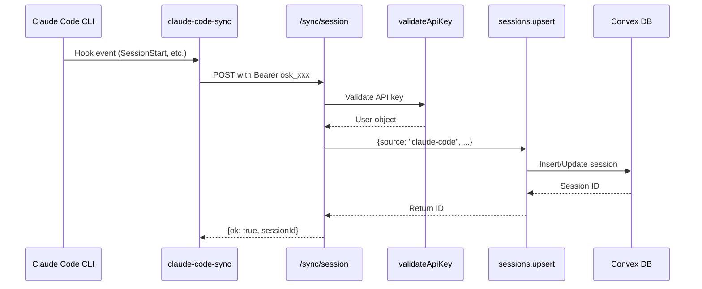

# Claude Code Sync Integration Plan

## Current State Analysis

The OpenSync app already has most infrastructure in place for claude-code-sync integration:

**Schema ([convex/schema.ts](convex/schema.ts))**

- `source` field exists on sessions table (line 34)
- `by_user_source` index exists for filtering (line 64)

**HTTP Endpoints ([convex/http.ts](convex/http.ts))**

- `/sync/session` endpoint passes `source: body.source` (line 118)
- `/sync/message` endpoint handles message sync (lines 138-166)
- API key authentication (`osk_` prefix) working (lines 35-52)

**Sessions Upsert ([convex/sessions.ts](convex/sessions.ts))**

- Accepts `source` arg (line 302)
- Defaults to "opencode" for backward compatibility (lines 319-321)
- Stores source on create (line 349) and update (line 329)

**Analytics ([convex/analytics.ts](convex/analytics.ts))**

- All queries accept `source` filter parameter
- `filterBySource` helper normalizes null/undefined to "opencode" (lines 5-9)

**Dashboard ([src/pages/Dashboard.tsx](src/pages/Dashboard.tsx))**

- `SourceDropdown` component exists (line 163-167)
- `sourceFilter` state with "all" | "opencode" | "claude-code" options (lines 53, 69)

## Data Flow Verification



## Required Changes

### 1. Verify Field Mapping (No Code Change Needed)

The plugin sends data that maps correctly to OpenSync:

| Plugin Field | HTTP Body | Convex Field |

|-------------|-----------|--------------|

| `sessionId` | `externalId` | `externalId` |

| `source` | `source` | `source` |

| `projectPath` | `projectPath` | `projectPath` |

| `projectName` | `projectName` | `projectName` |

| `model` | `model` | `model` |

| `title` | `title` | `title` |

The plugin transforms `sessionId` to `externalId` before sending.

### 2. Add sourceStats Query (Optional Enhancement)

Add a new query in [convex/analytics.ts](convex/analytics.ts) to show source distribution:

```typescript
export const sourceStats = query({
  args: {},
  returns: v.array(v.object({
    source: v.string(),
    sessions: v.number(),
    totalTokens: v.number(),
    cost: v.number(),
  })),
  handler: async (ctx) => {
    // Group sessions by source ("opencode", "claude-code")
  },
});
```

### 3. Add Visual Source Badge in Dashboard (Optional Enhancement)

In [src/pages/Dashboard.tsx](src/pages/Dashboard.tsx), show a badge/icon next to sessions indicating their source (Claude icon for claude-code sessions).

### 4. Verify Messages Auto-Create Session

The [convex/messages.ts](convex/messages.ts) `upsert` function auto-creates sessions if they dont exist (lines 39-63), but does NOT set `source`. This is a gap.

**Fix:** When auto-creating a session in messages.upsert, we should accept and pass through a `source` parameter.

### 5. Test Connectivity

Run verification commands:

```bash
# Configure plugin
claude-code-sync login
claude-code-sync setup
claude-code-sync verify

# Test sync
claude-code-sync synctest
```

## Implementation Tasks

1. **Update messages.upsert** - Accept optional `source` parameter and pass to auto-created sessions
2. **Update /sync/message endpoint** - Pass `source` from request body to messages.upsert
3. **Add sourceStats query** - Show sessions grouped by source in analytics
4. **Add source badge in UI** - Visual indicator for session source
5. **Test end-to-end** - Run synctest and verify data appears with source="claude-code"

## Files to Modify

- `convex/messages.ts` - Add source parameter to upsert
- `convex/http.ts` - Pass source to messages.upsert call
- `convex/analytics.ts` - Add sourceStats query
- `src/pages/Dashboard.tsx` - Add source badge component

## Testing Checklist

- [ ] Plugin can authenticate with API key
- [ ] SessionStart creates session with source="claude-code"
- [ ] Messages sync correctly
- [ ] Dashboard shows source filter working
- [ ] Sessions display claude-code badge when filtered